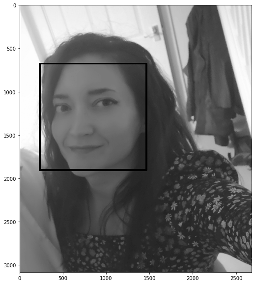
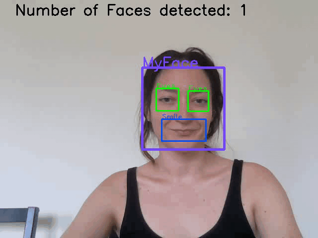

# Real-time-face-detection-OpenCV
  Haar Cascade Classifiers
  
  Note: You can read the full story on [Medium](https://medium.com/@cristinamanoila28/face-recognition-using-opencv-haar-cascade-classifications-1d42a7a5897).

***1.Introduction***

In this tutorial we will see:

-how we utilize OpenCV Library to make a Real-Time Face Detection using your webcam as a primary camera.

The work was performed on Windows 10 using:

-Python 3.7

-OpenCV

-the basic of face detection using Haar Feature-based Cascade Classifiers extended for eye and smile
    
***2. Imports***

The first step is to import cv2
OpenCV comes with pre-trained classifiers for faces, eyes, smiles and so forth. These pre-trained classifiers are XML files stored in [here](https://github.com/opencv/opencv/tree/master/data/haarcascades) and need to be cloned to your computer (step 2) and then declared the cascade classifiers.

***3.Face detection***
For performing the face detection on images we need to process the image by gray scaling it and apply the classifier. Once doing these the output will look like 

***4. Real time face-detection***
The first step towards reading a video file is to create a VideoCapture object and then VideoWrite defining the 4-character code of codec used to compress the frames.
For real-time face-detection we will use the same procedure as face-detection on images but this time adding the cascade classifiers for eyes and smile in a for loop.
We will expect to see the following result: 

